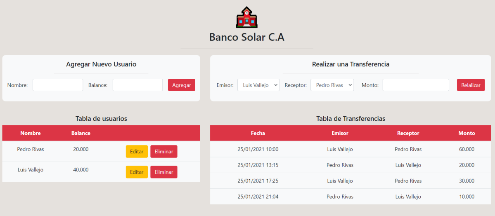

# Prueba - Acceso a datos en aplicaciones Node

El Banco Solar acaba de decidir invertir una importante suma de dinero para contratar un
equipo de desarrolladores Full Stack que desarrollen un nuevo sistema de transferencias, y
han anunciado que todo aquel que postule al cargo debe realizar un servidor con Node que
utilice PostgreSQL para la gestión y persistencia de datos, y simular un sistema de
transferencias.
El sistema debe permitir registrar nuevos usuarios con un balance inicial y basados en estos,
realizar transferencias de saldos entre ellos.
En esta prueba contarás con una aplicación cliente preparada para consumir las rutas que
deberás crear en el servidor. A continuación se muestra una imagen con la interfaz
mencionada.

